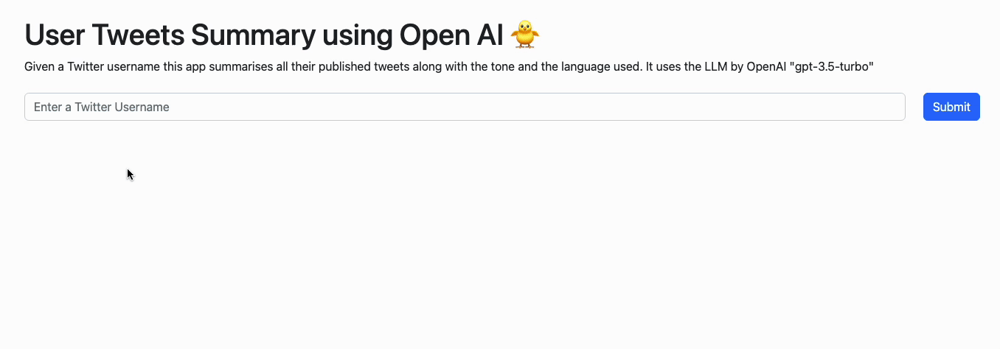

# Spring Boot Twitter OpenAI Summary

This is a Spring Boot application that uses the Twitter API to get the latest tweets published by a user and then uses the OpenAI API to summarize the tweets in terms of the content, topics and sentiment. This repo is an inspiration from the [should-i-follow](https://github.com/TuanaCelik/should-i-follow) project.



## Twitter API

The app uses the following Twitter APIv2 endpoints

| API                                                          | Description                                                                           |
|--------------------------------------------------------------|---------------------------------------------------------------------------------------|
| `POST https://api.twitter.com/oauth2/token`                  | Generate an access token (Bearer token) for app only                                  |
| `GET https://api.twitter.com/2/users/by/username/{username}` | User details lookup by username                                                       |
| `GET https://api.twitter.com/2//users/{id}/tweets`           | Tweets published by a specific Twitter account. Uses the default of maximum 10 tweets |

Twitter API authentication uses [application-only](https://developer.twitter.com/en/docs/authentication/oauth-2-0/application-only) technique. The app generates an App only access token(Bearer token) by passing the Twitter consumer key and consumer secret to the `/token/oauth` endpoint.

Get access to the Twitter API by following the steps mentioned [here](https://developer.twitter.com/en/docs/twitter-api/getting-started/getting-access-to-the-twitter-api). The API docs can be found [here](https://developer.twitter.com/en/docs/twitter-api/tweets/timelines/api-reference/get-users-id-tweets)

## OpenAI API

The app uses the following OpenAI API endpoints

| API                                               | Description                               |
|---------------------------------------------------|-------------------------------------------|
| `POST https://api.openai.com/v1/chat/completions` | Creates a completion for the chat message |

The OpenAI API uses API keys for authentication. Visit your [API Keys](https://platform.openai.com/account/api-keys) page to retrieve the API key. The API docs can be found [here](https://platform.openai.com/docs/api-reference/chat/create)

## Running the app

- Define the following environment variables

    ```bash
     export TWITTER-CONSUMER-KEY=<your-twitter-consumer-key>
     export TWITTER-CONSUMER-SECRET=<your-twitter-consumer-secret>
     export OPENAI-API-KEY=<your-openai-api-key>
    ```

- Start the application from the console by entering the command from the root of the project

    ```bash
    ./mvnw spring-boot:run
    ```
  Access the application at http://localhost:8080

